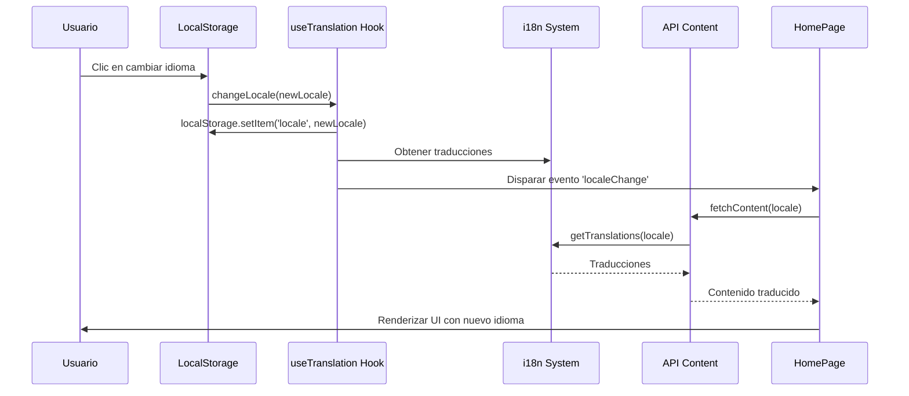

# Arquitectura de Brotea Landing

## Diagrama General de Arquitectura

```mermaid
graph TD
    subgraph "Frontend (Next.js)"
        A[Páginas] --> B[Componentes]
        B --> C[Hooks]
        C --> D[i18n]
        A --> E[API Routes]
    end
    
    subgraph "Backend (API Routes)"
        E --> F[Content API]
        E --> G[Newsletter API]
        G --> H[Mailtrap SMTP]
    end
    
    subgraph "Datos"
        F --> I[Archivos JSON de Traducción]
        G --> J[Formulario Newsletter]
    end
    
    subgraph "Servicios Externos"
        H --> K[Email Service]
    end
    
    style A fill:#E6FFA9,stroke:#333,stroke-width:2px
    style B fill:#E6FFA9,stroke:#333,stroke-width:2px
    style C fill:#E6FFA9,stroke:#333,stroke-width:2px
    style D fill:#E6FFA9,stroke:#333,stroke-width:2px
    style E fill:#FF8BA7,stroke:#333,stroke-width:2px
    style F fill:#FF8BA7,stroke:#333,stroke-width:2px
    style G fill:#FF8BA7,stroke:#333,stroke-width:2px
    style H fill:#8180FF,stroke:#333,stroke-width:2px
    style I fill:#8180FF,stroke:#333,stroke-width:2px
    style J fill:#8180FF,stroke:#333,stroke-width:2px
    style K fill:#0F0F1E,stroke:#333,stroke-width:2px
```



## Diagrama de Flujo de Datos

```mermaid
flowchart LR
    A[Usuario] --> B[Página Principal]
    A --> C[Página Stories]
    
    B --> D[Componentes UI]
    C --> D
    
    D --> E[useTranslation Hook]
    E --> F[i18n System]
    
    B --> G[Newsletter Form]
    G --> H[API Newsletter]
    H --> I[Mailtrap SMTP]
    I --> J[Email al Usuario]
    I --> K[Email al Admin]
    
    B --> L[API Content]
    L --> M[Archivos de Traducción]
    M --> B
    
    style A fill:#E6FFA9,stroke:#333,stroke-width:2px
    style B fill:#E6FFA9,stroke:#333,stroke-width:2px
    style C fill:#E6FFA9,stroke:#333,stroke-width:2px
    style D fill:#FF8BA7,stroke:#333,stroke-width:2px
    style E fill:#FF8BA7,stroke:#333,stroke-width:2px
    style F fill:#FF8BA7,stroke:#333,stroke-width:2px
    style G fill:#8180FF,stroke:#333,stroke-width:2px
    style H fill:#8180FF,stroke:#333,stroke-width:2px
    style I fill:#0F0F1E,stroke:#333,stroke-width:2px
    style J fill:#0F0F1E,stroke:#333,stroke-width:2px
    style K fill:#0F0F1E,stroke:#333,stroke-width:2px
    style L fill:#FF8BA7,stroke:#333,stroke-width:2px
    style M fill:#FF8BA7,stroke:#333,stroke-width:2px
```



## Diagrama de Componentes

```mermaid
classDiagram
    class HomePage {
        +useState() isMenuOpen
        +useState() data
        +useTranslation() locale, isLoaded
        +fetchContent()
        +scrollToSection()
        +render()
    }
    
    class StoriesPage {
        +useState() isMenuOpen
        +useTranslation()
        +scrollToSection()
        +render()
    }
    
    class TranslatedText {
        +textKey: string
        +className: string
        +useTranslation() t, isLoaded
        +render()
    }
    
    class LanguageSwitcher {
        +useTranslation() locale, changeLocale
        +render()
    }
    
    class NewsletterForm {
        +useState() status
        +useState() showErrorModal
        +useNewsletterStore() state, actions
        +handleSubmit()
        +render()
    }
    
    class useTranslation {
        +useState() locale
        +useState() isLoaded
        +useEffect() loadLocale
        +t() translate
        +changeLocale()
        +return {t, locale, isLoaded, changeLocale}
    }
    
    class i18nSystem {
        +languages
        +getNestedValue()
        +translate()
        +getTranslations()
        +defaultLocale
        +getAvailableLocales()
    }
    
    HomePage --> TranslatedText : uses
    HomePage --> LanguageSwitcher : uses
    HomePage --> NewsletterForm : uses
    StoriesPage --> TranslatedText : uses
    StoriesPage --> LanguageSwitcher : uses
    TranslatedText --> useTranslation : uses
    LanguageSwitcher --> useTranslation : uses
    NewsletterForm --> useTranslation : uses
    useTranslation --> i18nSystem : uses
```

## Diagrama de Secuencia para Cambio de Idioma



## Diagrama de Secuencia para Envío de Newsletter

```mermaid
sequenceDiagram
    participant U as Usuario
    participant NF as NewsletterForm
    participant API as API Newsletter
    participant SMTP as Mailtrap SMTP
    participant UA as Email Usuario
    participant AA as Email Admin
    
    U->>NF: Completa formulario
    U->>NF: Envía formulario
    NF->>API: POST /api/newsletter
    API->>SMTP: Configurar transporte
    API->>SMTP: Enviar email al usuario
    SMTP-->>UA: Email de confirmación
    API->>SMTP: Enviar email al admin
    SMTP-->>AA: Notificación de nuevo registro
    API-->>NF: Respuesta exitosa
    NF->>U: Mostrar confirmación
