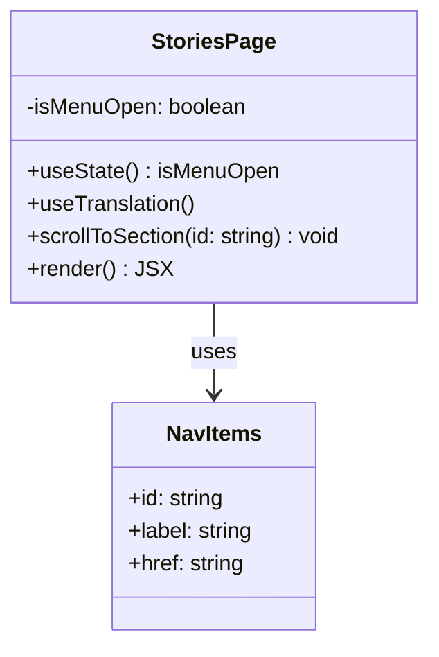
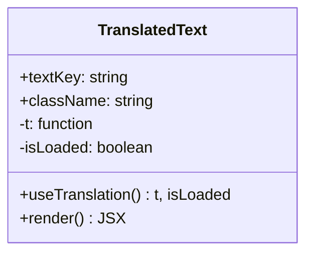
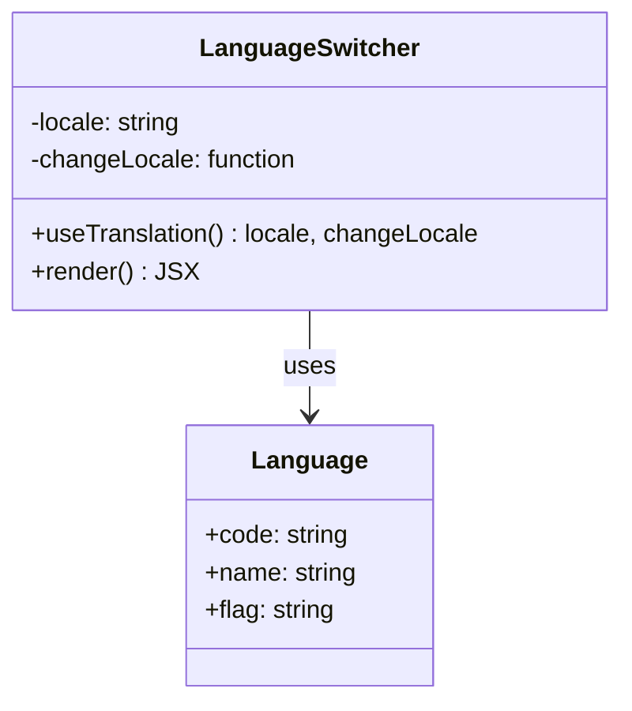
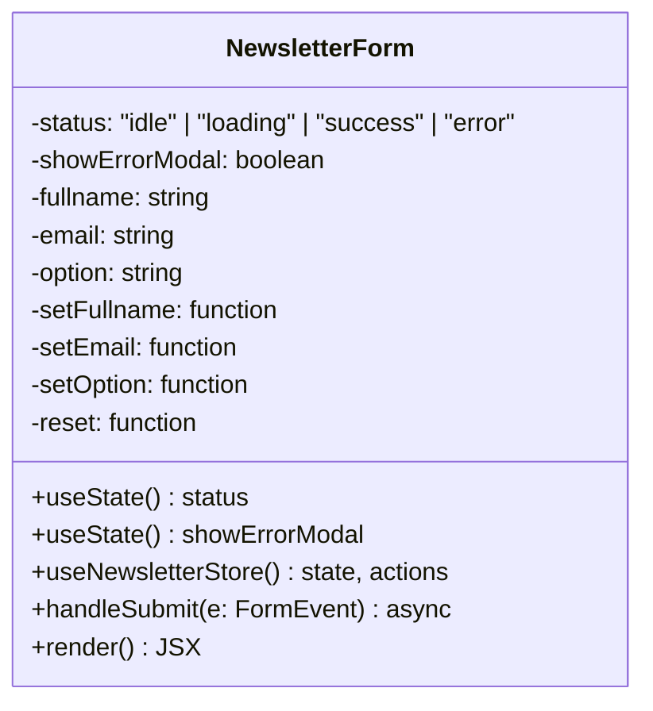
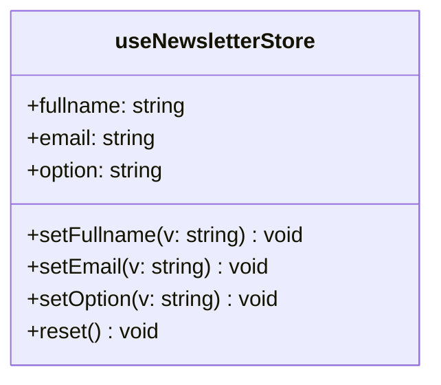
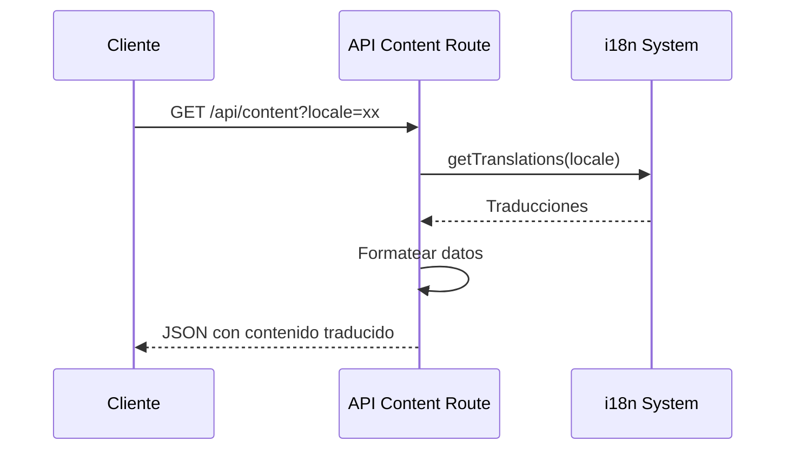

# Diagramas de Componentes de Brotea Landing

## Estructura de Componentes

```mermaid
graph TD
    subgraph "Páginas"
        A[HomePage]
        B[StoriesPage]
    end
    
    subgraph "Componentes Compartidos"
        C[TranslatedText]
        D[LanguageSwitcher]
        E[NewsletterForm]
    end
    
    subgraph "Hooks"
        F[useTranslation]
        G[useNewsletterStore]
    end
    
    subgraph "API Routes"
        H[Content API]
        I[Newsletter API]
    end
    
    A --> C
    A --> D
    A --> E
    B --> C
    B --> D
    C --> F
    D --> F
    E --> G
    E --> I
    A --> H
    
    style A fill:#E6FFA9,stroke:#333,stroke-width:2px
    style B fill:#E6FFA9,stroke:#333,stroke-width:2px
    style C fill:#FF8BA7,stroke:#333,stroke-width:2px
    style D fill:#FF8BA7,stroke:#333,stroke-width:2px
    style E fill:#FF8BA7,stroke:#333,stroke-width:2px
    style F fill:#8180FF,stroke:#333,stroke-width:2px
    style G fill:#8180FF,stroke:#333,stroke-width:2px
    style H fill:#0F0F1E,stroke:#333,stroke-width:2px
    style I fill:#0F0F1E,stroke:#333,stroke-width:2px
```



## Componente HomePage

```mermaid
classDiagram
    class HomePage {
        -isMenuOpen: boolean
        -data: BodyData | null
        -locale: string
        -isLoaded: boolean
        +useState() isMenuOpen
        +useState() data
        +useTranslation() locale, isLoaded
        +fetchContent() async
        +scrollToSection(id: string) void
        +render() JSX
    }
    
    class NavItems {
        +id: string
        +label: string
        +href: string
    }
    
    class BodyData {
        +header: HeaderData
        +about: SectionData
        +recruitment: SectionData
        +lisbonClub: SectionData
        +globalCommunity: SectionData
    }
    
    class HeaderData {
        +title: string
        +subtitle: string
        +cta: {text: string, link: string}
    }
    
    class SectionData {
        +title: string
        +description: string
    }
    
    HomePage --> NavItems : uses
    HomePage --> BodyData : uses
    BodyData --> HeaderData : contains
    BodyData --> SectionData : contains
```

## Componente StoriesPage



## Componente TranslatedText



## Componente LanguageSwitcher



## Componente NewsletterForm



## Hook useTranslation

```mermaid
classDiagram
    class useTranslation {
        -locale: Language
        -isLoaded: boolean
        +useState() locale
        +useState() isLoaded
        +useEffect() loadLocale
        +t(key: string) string
        +changeLocale(newLocale: Language) void
        +return {t, locale, isLoaded, changeLocale}
    }
    
    class Language {
        +en: {name: string, flag: string}
        +es: {name: string, flag: string}
    }
    
    useTranslation --> Language : uses
```

## Store useNewsletterStore



## API Content Route



## API Newsletter Route

```mermaid
sequenceDiagram
    participant C as Cliente
    participant API as API Newsletter Route
    participant SMTP as Mailtrap SMTP
    
    C->>API: POST /api/newsletter (FormData)
    API->>API: Validar datos
    API->>SMTP: Configurar transporte
    API->>SMTP: Enviar email al usuario
    API->>SMTP: Enviar email al admin
    API-->>C: Respuesta JSON (éxito/error)
