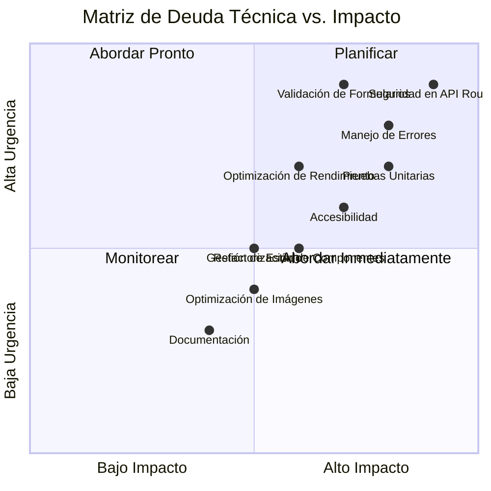
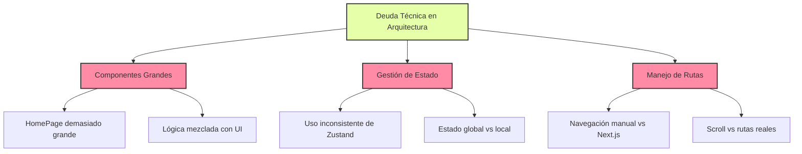
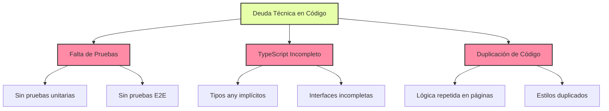
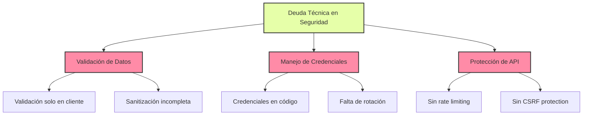
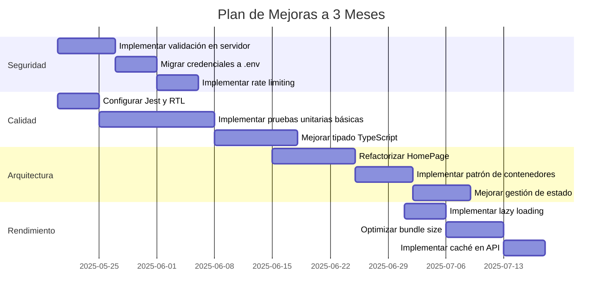
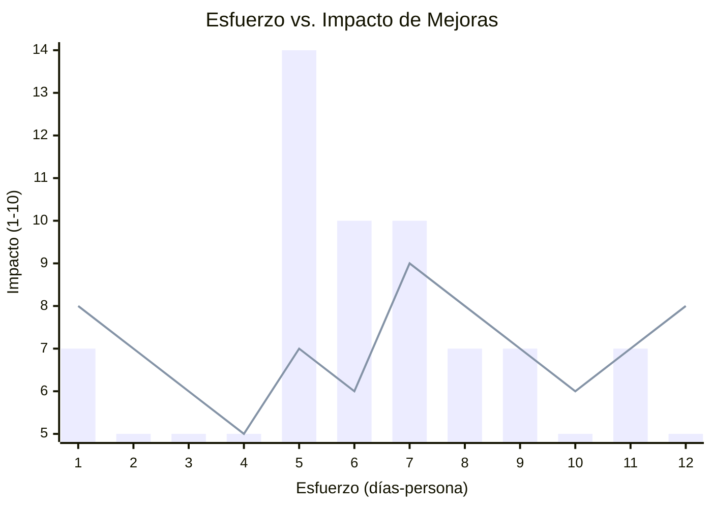
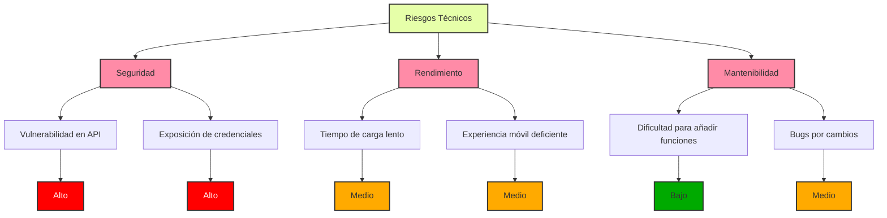

# Análisis de Deuda Técnica y Plan de Mejoras

## Mapa de Deuda Técnica

## Análisis de Deuda Técnica por Área

### Arquitectura

### Calidad de Código

### Seguridad

## Plan de Mejoras

### Priorización de Tareas

### Estimación de Esfuerzo vs. Impacto

## Análisis de Riesgos

## Recomendaciones Técnicas Detalladas

### Arquitectura

1. **Refactorización de Componentes**
   - Dividir HomePage en componentes más pequeños y reutilizables
   - Implementar patrón de contenedores/presentación
   - Extraer lógica de negocio a hooks personalizados

2. **Gestión de Estado**
   - Estandarizar el uso de Zustand para estado global
   - Implementar selectores para optimizar renderizados
   - Documentar patrones de estado

3. **Navegación**
   - Migrar de scrollToSection a rutas reales de Next.js
   - Implementar transiciones de página
   - Mejorar SEO con metadatos por página

### Calidad de Código

1. **Pruebas**
   - Configurar Jest y React Testing Library
   - Implementar pruebas unitarias para componentes clave
   - Añadir pruebas E2E con Cypress o Playwright
   - Configurar CI/CD para ejecución automática de pruebas

2. **TypeScript**
   - Eliminar usos de `any`
   - Completar interfaces y tipos
   - Implementar validación de esquemas con Zod o Yup
   - Configurar reglas de ESLint más estrictas

3. **Documentación**
   - Documentar componentes con JSDoc
   - Crear storybook para componentes UI
   - Documentar API routes
   - Crear guía de contribución

### Seguridad

1. **Validación de Datos**
   - Implementar validación en servidor para todas las API routes
   - Sanitizar inputs para prevenir XSS
   - Implementar middleware de validación

2. **Credenciales**
   - Migrar todas las credenciales a variables de entorno
   - Implementar rotación de credenciales
   - Configurar secretos en plataforma de despliegue

3. **Protección de API**
   - Implementar rate limiting
   - Añadir protección CSRF
   - Implementar logging de seguridad
   - Configurar headers de seguridad

### Rendimiento

1. **Optimización de Carga**
   - Implementar lazy loading para componentes grandes
   - Optimizar bundle size con análisis de webpack
   - Implementar code splitting

2. **Optimización de Imágenes**
   - Revisar y optimizar todas las imágenes
   - Implementar formatos modernos (WebP, AVIF)
   - Configurar tamaños responsivos

3. **Caché y API**
   - Implementar estrategias de caché para API routes
   - Optimizar fetching de datos
   - Implementar SWR o React Query para gestión de datos
