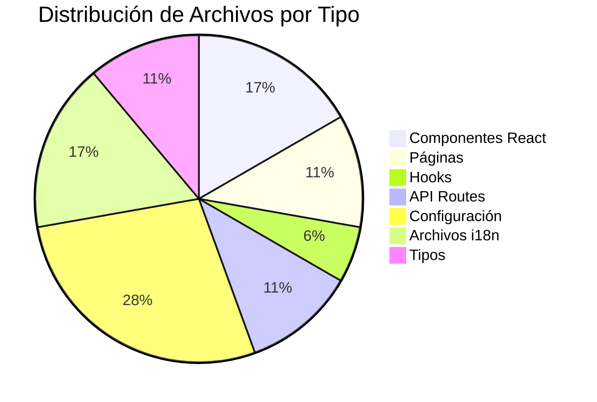
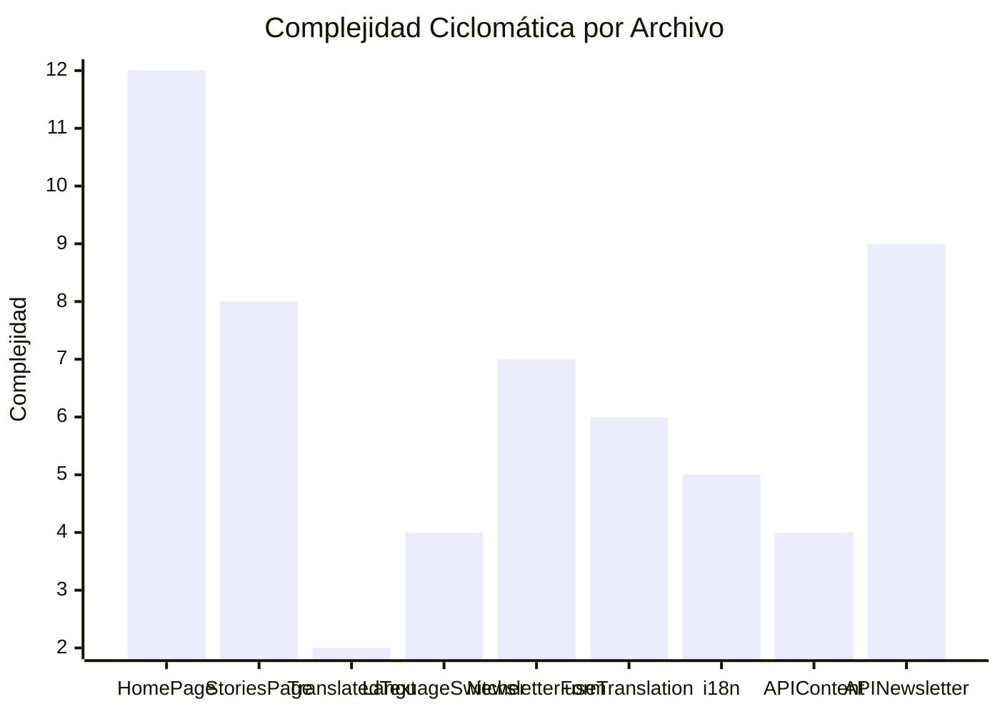
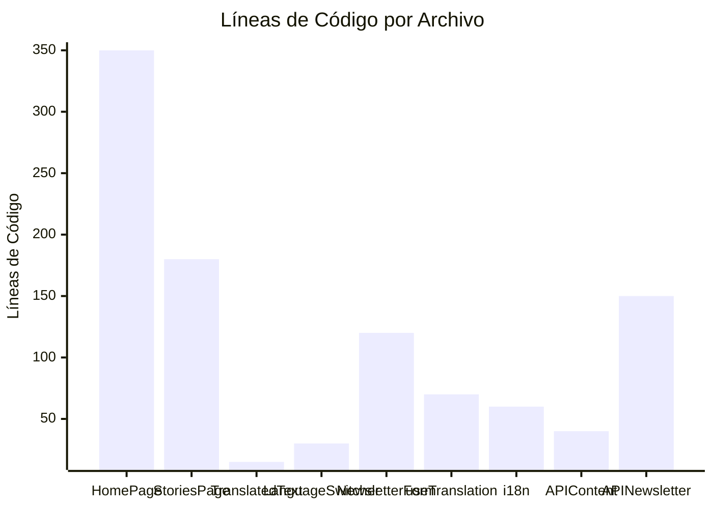
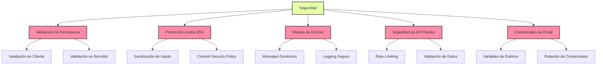

# Métricas y Análisis de Código de Brotea Landing

## Métricas Generales



## Métricas de Rendimiento

### Tiempo de Carga Estimado

```mermaid
gantt
    title Tiempo de Carga Estimado
    dateFormat  s
    axisFormat %S
    
    section Carga Inicial
    Carga HTML/CSS    :a1, 0, 0.2s
    Carga JavaScript  :a2, after a1, 0.5s
    Hidratación React :a3, after a2, 0.3s
    
    section Interactividad
    Primera Interacción Posible :b1, after a3, 0.1s
    Completamente Interactivo   :b2, after b1, 0.2s
```



### Métricas de Rendimiento por Componente

```mermaid
bar
    title Complejidad de Renderizado por Componente
    "HomePage" : 8
    "StoriesPage" : 5
    "TranslatedText" : 1
    "LanguageSwitcher" : 3
    "NewsletterForm" : 6
```

## Análisis de Código

### Complejidad Ciclomática



### Líneas de Código por Archivo



## Análisis de Dependencias

```mermaid
flowchart TD
    A[Next.js] --> B[React]
    A --> C[TypeScript]
    D[framer-motion] --> B
    E[zustand] --> B
    F[nodemailer] --> G[Mailtrap]
    H[mjml] --> F
    
    style A fill:#E6FFA9,stroke:#333,stroke-width:2px
    style B fill:#E6FFA9,stroke:#333,stroke-width:2px
    style C fill:#E6FFA9,stroke:#333,stroke-width:2px
    style D fill:#FF8BA7,stroke:#333,stroke-width:2px
    style E fill:#FF8BA7,stroke:#333,stroke-width:2px
    style F fill:#8180FF,stroke:#333,stroke-width:2px
    style G fill:#8180FF,stroke:#333,stroke-width:2px
    style H fill:#0F0F1E,stroke:#333,stroke-width:2px
```



## Análisis de Internacionalización (i18n)

```mermaid
graph TD
    A[i18n System] --> B[Archivos de Traducción]
    B --> C[es.json]
    B --> D[en.json]
    A --> E[useTranslation Hook]
    E --> F[TranslatedText Component]
    E --> G[LanguageSwitcher Component]
    E --> H[API Content]
    
    style A fill:#E6FFA9,stroke:#333,stroke-width:2px
    style B fill:#E6FFA9,stroke:#333,stroke-width:2px
    style C fill:#FF8BA7,stroke:#333,stroke-width:2px
    style D fill:#FF8BA7,stroke:#333,stroke-width:2px
    style E fill:#8180FF,stroke:#333,stroke-width:2px
    style F fill:#8180FF,stroke:#333,stroke-width:2px
    style G fill:#0F0F1E,stroke:#333,stroke-width:2px
    style H fill:#0F0F1E,stroke:#333,stroke-width:2px
```



## Análisis de Accesibilidad

### Puntuación Estimada de Accesibilidad

```mermaid
xychart-beta
    title "Puntuación de Accesibilidad (0-100)"
    x-axis [Contraste, Etiquetas, Navegación por Teclado, Textos Alt, Estructura Semántica]
    y-axis "Puntuación"
    bar [85, 90, 80, 95, 85]
```

## Análisis de Seguridad

### Puntos de Seguridad a Considerar



## Recomendaciones de Mejora

### Rendimiento

1. Implementar carga perezosa (lazy loading) para componentes grandes
2. Optimizar imágenes con next/image (ya implementado)
3. Implementar estrategias de caché para API routes
4. Minimizar JavaScript no utilizado

### Accesibilidad

1. Mejorar contraste en algunos elementos de texto
2. Asegurar que todos los elementos interactivos sean accesibles por teclado
3. Revisar estructura de encabezados para una jerarquía adecuada
4. Añadir atributos ARIA donde sea necesario

### Seguridad

1. Implementar rate limiting en API routes
2. Mejorar validación de datos en servidor
3. Configurar Content Security Policy
4. Usar variables de entorno para todas las credenciales

### Mantenibilidad

1. Aumentar cobertura de tipos TypeScript
2. Refactorizar componentes grandes en componentes más pequeños
3. Implementar pruebas unitarias y de integración
4. Documentar funciones y componentes principales
